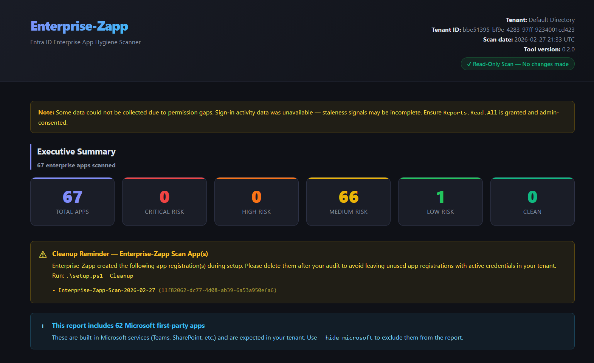

<p align="center">
<pre>
  ███████╗ ███╗  ██╗ ████████╗ ███████╗ ██████╗  ██████╗ ██╗ ███████╗ ███████╗
  ██╔════╝ ████╗ ██║ ╚══██╔══╝ ██╔════╝ ██╔══██╗ ██╔══██╗██║ ██╔════╝ ██╔════╝
  █████╗   ██╔██╗██║    ██║    █████╗   ██████╔╝ ██████╔╝██║ ███████╗ █████╗
  ██╔══╝   ██║╚████║    ██║    ██╔══╝   ██╔══██╗ ██╔═══╝ ██║ ╚════██║ ██╔══╝
  ███████╗ ██║ ╚███║    ██║    ███████╗ ██║  ██║ ██║     ██║ ███████║ ███████╗
  ╚══════╝ ╚═╝  ╚══╝    ╚═╝    ╚══════╝ ╚═╝  ╚═╝ ╚═╝     ╚═╝ ╚══════╝ ╚══════╝

                     ███████╗  █████╗  ██████╗  ██████╗
                     ╚════██║ ██╔══██╗ ██╔══██╗ ██╔══██╗
                         ██╔╝ ███████║ ██████╔╝ ██████╔╝
                        ██╔╝  ██╔══██║ ██╔═══╝  ██╔═══╝
                     ███████╗ ██║  ██║ ██║      ██║
                     ╚══════╝ ╚═╝  ╚═╝ ╚═╝      ╚═╝
</pre>
</p>

<p align="center">
  <strong>Zap the stale. Secure the rest.</strong><br/>
  Free, open-source Entra ID enterprise app hygiene scanner
</p>

<p align="center">
  
  
  
  
  
</p>

---

Enterprise-Zapp scans your Microsoft Entra ID tenant for enterprise app hygiene issues — expired credentials, stale apps, orphaned registrations, and over-privileged service principals — and produces a detailed, self-contained HTML report you can open in any browser, share with your team, or drop into an audit package.

> **Strictly read-only.** Enterprise-Zapp never modifies your tenant. It collects data, surfaces risks, and tells you what to fix. Your team makes the call.

---

## Screenshots

> 📸 _Screenshots coming soon. Run the tool and open the HTML report to see it in action._
>
> <!-- To add screenshots: place images in /assets/ and reference them here -->
> <!-- Example:  -->

**What the terminal output looks like:**

```
  ╔══════════════════════════════════════════╗
  ║  Risk Summary — 67 apps scanned         ║
  ╠════════════╦═══════╦═════════════════════╣
  ║ Critical   ║     2 ║ AppX, OldAPI        ║
  ║ High       ║     8 ║ Stale-Bot, ...      ║
  ║ Medium     ║    41 ║ Teams, SharePoint.. ║
  ║ Low        ║    14 ║                     ║
  ║ Clean      ║     2 ║                     ║
  ╚════════════╩═══════╩═════════════════════╝
```

**The HTML report includes:**
- 📊 Risk distribution summary with band counts
- 🔍 Filterable, sortable full app inventory (filter by risk band, hide Microsoft apps, search by name)
- 🚨 Critical & High risk app drill-down
- 💀 Stale and never-used apps
- 🔑 Expired and near-expiry credential tracker
- 👻 Orphaned apps (no owners, or disabled-account owners)
- ⚠️ High-privilege apps with no recent activity
- 🛠️ Cleanup reminder for apps created by Enterprise-Zapp itself
- 📋 Per-app signals with remediation recommendations

---

## What It Finds

| Signal | Severity |
|--------|----------|
| Expired client secrets or certificates | **Critical** |
| High-privilege permissions on a stale app | **Critical** |
| App has never signed in | High |
| Stale app — no sign-in in 90+ days | High |
| No owners defined | High |
| Owners are disabled/deleted accounts | High |
| Client secret or cert expiring within 30 days | High |
| Service principal is disabled but not deleted | Medium |
| No user/group assignments | Medium |
| Long-lived client secrets (>1 year) | Low |

Each app receives a **risk score (0–100)** and a **risk band** (Critical / High / Medium / Low / Clean), with a prioritised primary recommendation.

---

## What It Does NOT Do

- Does **not** modify, disable, or delete any app or service principal
- Does **not** revoke credentials or permissions
- Does **not** send data to any external service
- Does **not** require persistent infrastructure or a deployed application
- Does **not** store credentials — authentication uses Microsoft's device code flow

---

## Prerequisites

| Requirement | Notes |
|-------------|-------|
| PowerShell 7+ | For `setup.ps1` — one-time app registration |
| Microsoft.Graph PowerShell module | Auto-installed by `setup.ps1` |
| Global Admin or Privileged Role Admin | Required for `setup.ps1` only |
| Python 3.10+ | For the scan tool |

---

## Quick Start

### Step 1 — Create the temporary app registration

Open PowerShell as a **Global Admin or Privileged Role Admin** and run:

```powershell
.\setup.ps1
```

This creates a temporary, read-only app registration in your tenant, grants admin consent for the required permissions, and saves the client ID and tenant ID to `enterprise_zapp_config.json`.

> **Takes ~30 seconds.** No persistent infrastructure. Deletable immediately after the scan.

### Step 2 — Install Python dependencies

```bash
pip install -r requirements.txt
```

### Step 3 — Run the scan

```bash
python -m src.cli
```

You'll be prompted to authenticate via Microsoft's device code flow — no passwords stored, no service accounts required:

```
To sign in, use a web browser to open https://microsoft.com/devicelogin
and enter the code: ABCD-1234
```

Reports are written to `./output/` when the scan completes.

### Step 4 — Clean up

```powershell
.\setup.ps1 -Cleanup
```

Deletes the temporary app registration from your tenant.

---

## CLI Options

```
Usage: enterprise-zapp [OPTIONS]

Options:
  -t, --tenant TENANT_ID           Entra tenant ID or domain. Reads from config if omitted.
  -c, --client-id CLIENT_ID        Azure app registration client ID. Reads from config if omitted.
  --config PATH                    Path to enterprise_zapp_config.json.
  --stale-days DAYS                Days without sign-in before an app is stale. [default: 90]
  -o, --output DIR                 Output directory for reports. [default: ./output]
  --from-cache CACHE_FILE          Re-use collected data without re-querying Graph API.
  --hide-microsoft / --show-microsoft
                                   Exclude Microsoft first-party apps from the report.
  --skip-pdf                       Skip PDF generation.
  -V, --version                    Show version.
  --help                           Show help.
```

### Examples

```bash
# Standard scan
enterprise-zapp

# Exclude Microsoft built-in apps (Teams, SharePoint, etc.) from the report
enterprise-zapp --hide-microsoft

# Tighten the staleness threshold to 60 days
enterprise-zapp --stale-days 60

# Re-generate the report from cached data — instant, no auth or API calls
enterprise-zapp --from-cache ./output/raw_contoso_2026-02-27.json

# Write reports to a custom folder
enterprise-zapp --output ./reports/q1-audit/
```

---

## Output Files

| File | Description |
|------|-------------|
| `enterprise_zapp_<tenant>_<date>.html` | Self-contained HTML report — works offline, no CDN |
| `enterprise_zapp_<tenant>_<date>.csv` | Flat CSV for Excel, Power BI, or ticketing systems |
| `enterprise_zapp_<tenant>_<date>.pdf` | PDF for audit delivery or executive review |
| `raw_<tenant>_<date>.json` | Raw collected data — use with `--from-cache` to re-run reports instantly |

---

## Permissions Used

Enterprise-Zapp requests the following **read-only** Microsoft Graph permissions:

| Permission | Purpose |
|------------|---------|
| `Application.Read.All` | Read enterprise app and service principal data |
| `Directory.Read.All` | Read users, groups, and org structure |
| `AuditLog.Read.All` | Read sign-in logs for staleness detection |
| `Reports.Read.All` | Read service principal sign-in activity |
| `Policy.Read.All` | Read conditional access and policy data |
| `Organization.Read.All` | Read tenant display name |

> **Note:** Sign-in activity (`AuditLog.Read.All`) requires Entra ID P1/P2 licensing. In free tenants, staleness signals will be limited — the report notes which data was unavailable.

---

## Project Structure

```
enterprise-zapp/
├── setup.ps1                  # PowerShell: create/delete temp app registration
├── src/
│   ├── auth.py                # MSAL device code authentication
│   ├── graph.py               # Graph API client (pagination, retry, rate limiting)
│   ├── collector.py           # Data collection orchestration
│   ├── analyzer.py            # Signal evaluation + risk scoring engine
│   ├── reporter.py            # HTML / CSV / PDF generation
│   └── cli.py                 # Click CLI entrypoint + banner
├── templates/
│   └── report.html.j2         # Self-contained Jinja2 HTML report template
├── tests/
│   ├── test_analyzer.py       # Unit tests (no network calls)
│   └── fixtures/              # Sample data for tests
├── requirements.txt
├── pyproject.toml
└── LICENSE                    # MIT
```

---

## Running Tests

```bash
pip install pytest
pytest tests/ -v
```

---

## Frequently Asked Questions

**Does this require a persistent app registration?**
No. `setup.ps1` creates a named, temporary registration (e.g. `Enterprise-Zapp-Scan-2026-02-27`) that you delete immediately after the scan. The HTML report includes a cleanup reminder.

**Can this be run against Azure Government or other sovereign clouds?**
The current version targets the commercial Azure cloud (`graph.microsoft.com`). Sovereign cloud support is planned.

**How long does a scan take?**
For a tenant with ~100 apps, expect 1–2 minutes. For 500+ apps, 4–8 minutes. A progress bar is shown throughout.

**Can I re-run the report without re-authenticating?**
Yes. Use `--from-cache ./output/raw_<tenant>_<date>.json` to re-render the report from previously collected data — instant, no API calls, no auth.

**What happens if I don't have `AuditLog.Read.All` or lack P1/P2 licensing?**
The scan still runs. Sign-in activity data will be unavailable, so staleness signals will be limited. The report clearly notes which data was skipped and why.

**Why does my report show mostly Microsoft apps?**
Microsoft first-party apps (Teams, SharePoint, Viva, etc.) are service principals in every tenant. Use `--hide-microsoft` or click the "Hide Microsoft Apps" toggle in the report to focus on your own apps.

---

## Author

**Scott Altiparmak**
[linkedin.com/in/scottaltiparmak](https://www.linkedin.com/in/scottaltiparmak/)

---

## Contributing

Contributions are welcome. Please open an issue before submitting a large pull request.

- Bug reports: [GitHub Issues](https://github.com/scottalt/Enterprise-Zapp/issues)
- Feature requests: open an issue with the `enhancement` label

---

## License

[MIT License](LICENSE) — free to use, modify, and distribute. Attribution appreciated.

---

## Disclaimer

> **IMPORTANT — READ BEFORE USE**
>
> Enterprise-Zapp is provided **"as-is"**, without warranty of any kind, express or implied. The author, **Scott Altiparmak**, accepts **no responsibility or liability** for any issues, damages, data loss, security incidents, tenant disruptions, compliance violations, or any other consequences arising from running this tool in your environment.
>
> - This tool is provided for **informational and educational purposes only** and does not constitute security advice.
> - You are solely responsible for validating all findings before taking any remediation action.
> - Always follow your organisation's change management, security review, and approval processes.
> - Test in a non-production environment before running against any sensitive tenant.
> - By using this tool you agree that you do so **entirely at your own risk**.
